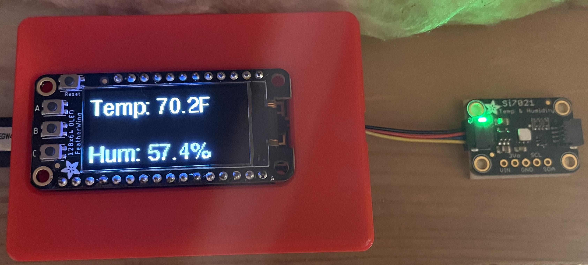

# Humidity and Temperature Monitor

Sketch for Humidity and temperature monitor built on the Adafruit Feather Huzzah development board with the Adafruit Si7021 sensor.  Optionally, the Adafruit FeatherWing 128x64 OLED can be used to dislay humidity and temperature data.  The data is also sent to Adafruit IO and to a separate Mosquitto broker via [MQTT](https://mqtt.org).  The Mosquitto broker is used with [Homebridge](https://github.com/homebridge/homebridge) and the [Homebridge MQTT-Thing](https://github.com/arachnetech/homebridge-mqttthing#readme) plugin to allow the humidity and temperture to be displayed on the Apple Home App.

[](https://opensource.org/licenses/MIT)

## Development platform

The development and target platform for this project is the Adafruit Feather Huzzah ESP8266, Adafruit Si7021 Temperature & Humidity Breakout Board w/ STEMMA QT, and Adafruit FeatherWing 128x64 OLED.

## Project build platform

This project was developed with and uses [PlatformIO](https://platformio.org) extension to [Visual Studio Code](https://code.visualstudio.com).

## Credits and tutorials

* [Adafruit Feather Huzzah ESP8266 Tutorial](https://learn.adafruit.com/adafruit-feather-huzzah-esp8266)
* [Adafruit Si7021 Temperature + Humidity Sensor Tutorial](https://learn.adafruit.com/adafruit-si7021-temperature-plus-humidity-sensor)
* [Adafruit 128x64 OLED FeatherWing Tutorial](https://learn.adafruit.com/adafruit-128x64-oled-featherwing)
* [Adafruit IO Tutorial](https://learn.adafruit.com/adafruit-io/getting-started)

## Hardware and parts

* [Adafruit Feather HUZZAH with ESP8266](https://www.adafruit.com/product/2821)
* [Adafruit Si7021 Temperature & Humidity Sensor Breakout Board - STEMMA QT](https://www.adafruit.com/product/3251)
* [Adafruit FeatherWing 128x64 OLED with STEMMA QT/Qwiic](https://www.adafruit.com/product/4650)
* [STEMMA QT / Qwiic JST SH 4-pin Cable - 100mm Long](https://www.adafruit.com/product/4210)
* [5V 2.5A Switching Power Supply with 20AWG MicroUSB Cable](https://www.adafruit.com/product/1995)
* [3D Printed Feather Box](https://learn.adafruit.com/3d-printed-case-for-adafruit-feather)

## Configuration

WiFi, Adafruit IO, and MQTT require specific configuration to connect to your Wifi router, Adafruit IO feed, and MQTT broker.  This will require editing the sketch, rebuilding, and uploading to MCU(micro controller unit).

### WiFi

Edit include/config.h and modify the following with your router SSID and password.

```C
#define WIFI_SSID "<WiFi SSID>"
#define WIFI_PASS "<WiFi Password>"
```

### Adafruit IO

Edit include/config.h and modify the following with your Adafruit IO user name and key.

```C
#define IO_USERNAME  "<Adafruit IO User Name>"
#define IO_KEY       "<Adafruit IO Key>"
```

Edit src/main.cpp and modify the following with your Adafruit IO feed.

```C
AdafruitIO_Feed *temperature_feed = io.feed("Adafruit IO feed.temperature");
AdafruitIO_Feed *humidity_feed    = io.feed("Adafruit IO feed.humidity");
```

### MQTT

Edit src/main.cpp and modify the following with your MQTT ID, topics, and MQTT broker IP address.

```C
const char *ID                = "Topic ID";
const char *HUMIDITY_TOPIC    = "crawlspace/dht22/humidity";
const char *TEMERATURE_TOPIC  = "crawlspace/dht22/temperature";

IPAddress broker(#,#,#,#);
```

## Future Features

* Over-the-air updates - Firmware updates over Wifi.
* Display buttions - Program display buttons to turn display on/off.

## Final Product



## License

MIT License

Copyright (c) 2021 Chuck Hunley

Permission is hereby granted, free of charge, to any person obtaining a copy of this software and associated documentation files (the "Software"), to deal in the Software without restriction, including without limitation the rights to use, copy, modify, merge, publish, distribute, sublicense, and/or sell copies of the Software, and to permit persons to whom the Software is furnished to do so, subject to the following conditions:

The above copyright notice and this permission notice shall be included in all copies or substantial portions of the Software.

THE SOFTWARE IS PROVIDED "AS IS", WITHOUT WARRANTY OF ANY KIND, EXPRESS OR IMPLIED, INCLUDING BUT NOT LIMITED TO THE WARRANTIES OF MERCHANTABILITY, FITNESS FOR A PARTICULAR PURPOSE AND NONINFRINGEMENT. IN NO EVENT SHALL THE AUTHORS OR COPYRIGHT HOLDERS BE LIABLE FOR ANY CLAIM, DAMAGES OR OTHER LIABILITY, WHETHER IN AN ACTION OF CONTRACT, TORT OR OTHERWISE, ARISING FROM, OUT OF OR IN CONNECTION WITH THE SOFTWARE OR THE USE OR OTHER DEALINGS IN THE SOFTWARE.
